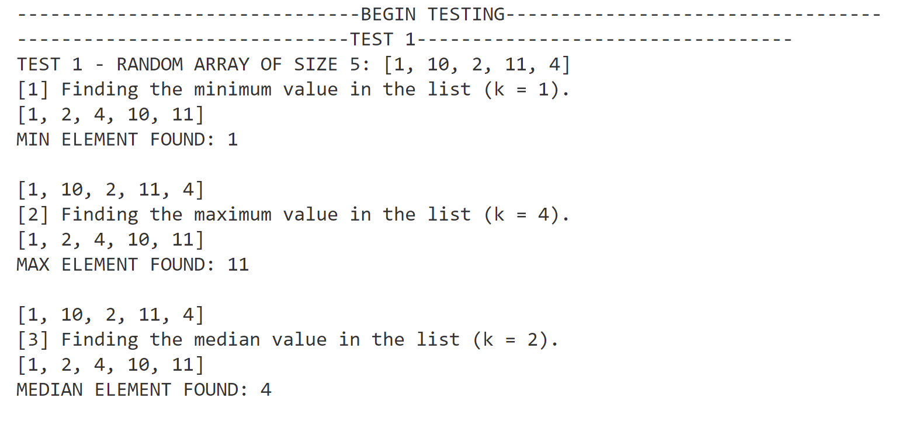
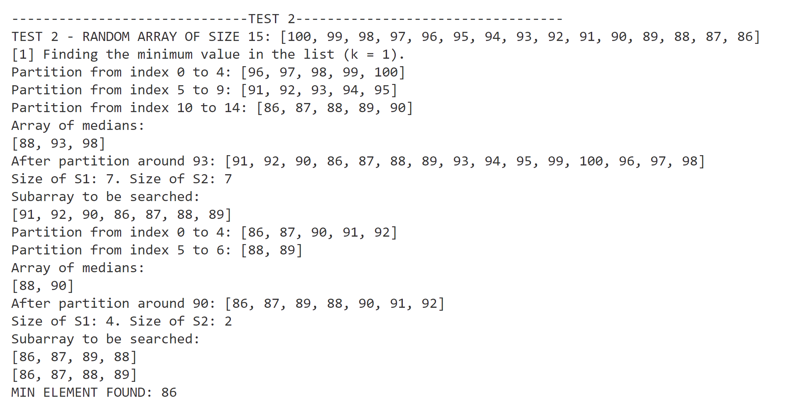
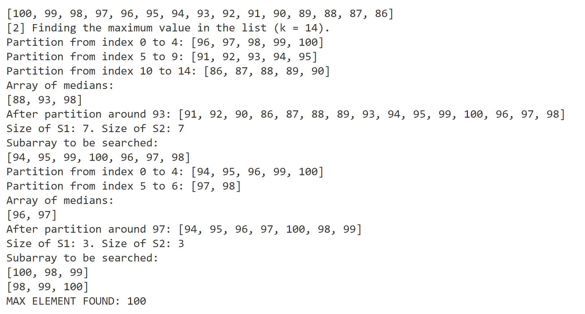
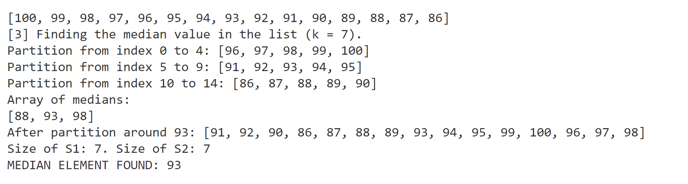

#### *Author: Erin Phillips*
#### *Date: 10/23/2022*
# **CSCI 310 - Assignment 3**
## **How it works:**
This program utilizes many helper methods for achieving the desired output per the assignment instructions. 

### Notable functions:
`partition(int[] arr, int m) {}`

This function implements the Lomuto partition algorithm described in the textbook page 159. Modifications were made to ensure the algorithm works properly. Lomuto's algorithm requires the pivot be in the last position. Since the median is not consistently in the correct position, I extracted the index of the median. Converting the array to an ArrayList allows the use of `indexOf()`. Then the median is placed in the last position and the partition algorithm continues normally. 

*I considered requiring arrays of the List interface, however, this would require the entire program to be modified. I found that simply having that addition where I needed was sufficient*

`select(int[] arr, int k) {}`

This function takes advantage of the partition function to extract important data about the subarrays S1 and S3. Allowing searches and sorting to be done *in-place* and without the use of additional arrays.  

## **Demonstration:**
### There are a total of 3 test cases, the last one is only demonstrated in the source code. 

- Testing on list of size 5. This demonstrates the `insertionSort()` function. 

___

- Testing on list of size 15. Each test finds the min, max, and median of the array. 
- The array was re-initialized before each sub-test. 
- You will see the original array, the divisions of the array into sequences of 5 elements, the computation of the median, and the results after the partition function. 
- 1st element (min):

- nth element (max):

- n/2 element (median):

